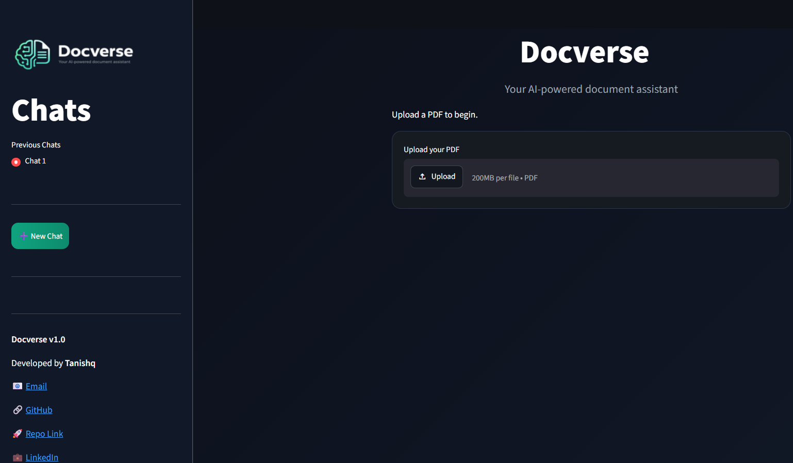
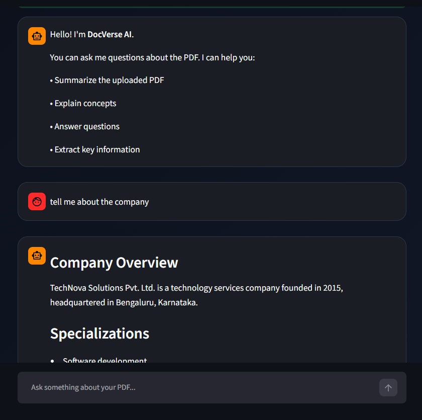

# 🧠 Docverse

**Docverse** is an AI-powered document assistant that allows users to upload PDF documents and chat with them naturally. Built using **Streamlit**, **LangChain**, **ChromaDB**, **Groq**, and **HuggingFace Embeddings**, Docverse enables intelligent document understanding through Retrieval-Augmented Generation (RAG).

---

## Features

* 📄 Upload and analyze PDF documents
* 💬 Chat with your PDFs using natural language
* 🔍 Retrieval-Augmented Generation (RAG)
* 🧠 Semantic search using vector embeddings
* ⚡ Fast responses powered by Groq LLMs
* 🗂️ Multiple chat sessions
* 🎨 Modern ChatGPT-inspired UI
* 🌙 Dark mode interface

---

## Tech Stack

### Frontend

* Streamlit
* HTML/CSS

### Backend

* Python
* LangChain

### AI & NLP

* Groq (LLM)
* HuggingFace Embeddings
* Sentence Transformers

### Vector Database

* ChromaDB

---

##  Project Structure

```text
Docverse/
│
├── chatbot.py          # Main application
├── style.css           # Custom styling
├── logo.png            # Project logo
├── requirements.txt    # Project dependencies
├── .env                # API keys
├── .gitignore
└── README.md
```

---

##  Installation

### 1. Clone the repository

```bash
git clone https://github.com/Tanishqdeep2005/DocVerse
cd docverse
```

### 2. Create a virtual environment (Recommended)

#### Windows

```bash
python -m venv venv
venv\Scripts\activate
```

#### Linux/macOS

```bash
python3 -m venv venv
source venv/bin/activate
```

### 3. Install Dependencies

```bash
pip install -r requirements.txt
```

---

##  Environment Variables

Create a `.env` file in the root directory and add your Groq API key:

```env
GROQ_API_KEY=your_groq_api_key_here
```

Get your API key from:

https://console.groq.com/keys

---

##  Running the Application

Run the following command:

```bash
streamlit run chatbot.py
```

The application will be available at:

```text
http://localhost:8501
```

---


##  How It Works

1. User uploads a PDF document.
2. The PDF is loaded using `PyPDFLoader`.
3. The document is split into smaller chunks.
4. Chunks are converted into vector embeddings.
5. Embeddings are stored in ChromaDB.
6. User asks a question.
7. Relevant chunks are retrieved using semantic search.
8. Retrieved context is passed to the Groq LLM.
9. The model generates a context-aware answer.

---

##  RAG Pipeline

```text
PDF Upload
    ↓
PyPDFLoader
    ↓
Text Splitting
    ↓
HuggingFace Embeddings
    ↓
Chroma Vector Store
    ↓
Retriever
    ↓
Groq LLM
    ↓
Answer Generation
```

---

##  Screenshots

### Home Screen





### Chat Interface





---

##  Future Improvements

* Support for multiple PDF uploads
* Persistent chat history
* Source citations for answers
* OCR support for scanned PDFs
* Cloud deployment
* User authentication
* Conversation memory across sessions

---

##  Author

**Tanishq**

* [GitHub](https://github.com/Tanishqdeep2005)
* [LinkedIn](https://www.linkedin.com/in/tanishqdeep/)

---


 If you found this project useful, consider giving it a star!
